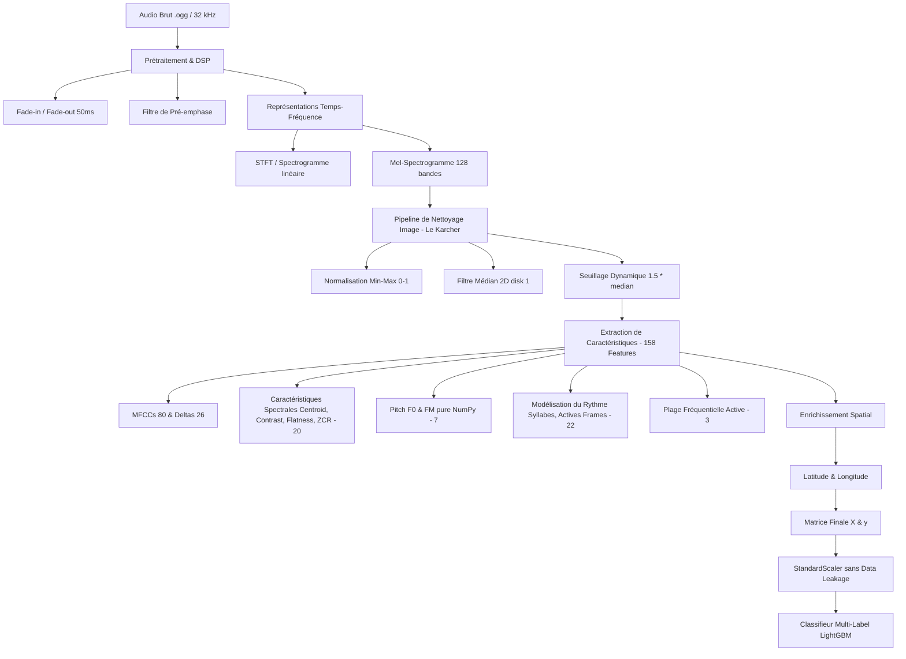

# Synthèse du Data Engineering — BirdCLEF 2026 (Pantanal, Brésil)

Ce document récapitule l'ensemble du travail de **Data Engineering, traitement du signal (DSP), réduction de bruit et pipeline d'extraction de caractéristiques** mené à travers les notebooks d'analyse exploratoire de données (`EAD.ipynb`, `EAD2.ipynb` et `EAD3.ipynb`). 

---

## 1. Vue d'Ensemble du Pipeline de Données

Le schéma ci-dessous résume le flux de traitement complet, de l'audio brut (32 kHz) jusqu'à la matrice finale à **160 dimensions** (158 caractéristiques bioacoustiques + latitude/longitude) injectée dans le classifieur multi-label LightGBM.

---

## 2. Analyse Détaillée par Notebook

### 📓 [EAD.ipynb](file:///Users/isaac/Documents/GitHub/Kaggle-BirdCLEF-2026/EAD.ipynb) — Fondations DSP, Index de Coïncidence et Signatures Pearson

Ce notebook pose les bases de l'analyse exploratoire des fichiers audio et teste les premiers algorithmes de traitement numérique du signal (DSP) et de classification.

#### A. Analyse Qualitative des Enregistrements
*   **Filtrage par note (`rating`)** : Exploration de l'intégrité des enregistrements courts issus de *Xeno-Canto* et *iNaturalist*.
*   **Gestion des valeurs inconnues** : Détection que la note `rating = 0` correspond à des métadonnées non renseignées et doit être exclue de l'évaluation qualitative globale.
*   **Profils espèces** : Identification et classement des espèces ayant les meilleures (notes médianes $\ge 4$) et les pires qualités d'enregistrement.

#### B. Traitement du Signal (DSP) & Conditionnement
*   **Standardisation fréquentielle** : Utilisation systématique d'une fréquence d'échantillonnage de **32 kHz** pour tous les traitements audio.
*   **Suppression de la composante continue (DC Offset Removal)** : Centrage rigoureux du signal en soustrayant sa moyenne (`y - np.mean(y)`) pour stabiliser l'énergie.
*   **Troncation des transitoires** : Suppression automatique des **500 premiers points** de chaque fichier audio pour éliminer les bruits parasites d'initialisation de microphone.
*   **Lissage spectral (Hanning Windowing)** : Application d'une fenêtre de Hanning (`np.hanning(len(y))`) avant le calcul de la FFT pour atténuer le débordement spectral (spectral leakage).
*   **Atténuation des bords (Fade-in / Fade-out)** : Implémentation d'une rampe linéaire de **50 ms** au début et à la fin de chaque audio pour supprimer les bruits de clic générés lors des découpes de fichiers.
*   **Localisation du signal utile (RMS Energy windowing)** : Implémentation d'un fenêtrage glissant de **5 secondes** avec un pas de **0.5 seconde** (`hop_size = sr // 2`) pour extraire le segment le plus riche et dense en vocalisations, déterminé par le calcul de l'énergie efficace quadratique RMS (`np.sqrt(np.mean(segment**2))`).
*   **Boost des hautes fréquences (Pré-emphase)** : Application d'un filtre passe-haut de pré-emphase (`librosa.effects.preemphasis`) pour contrebalancer l'atténuation naturelle des hautes fréquences, améliorant la capture des sifflements de passereaux et des bruits d'insectes.

#### C. Extraction SOTA & Caractéristiques Mathématiques / Crypto
*   **PCEN (Per-Channel Energy Normalization)** : Test d'une alternative robuste au logarithme du Mel-spectrogramme pour normaliser dynamiquement le gain par canal, rendant le modèle résilient aux variations d'appareils d'enregistrement.
*   **Moments Statistiques Spectraux** : Calcul de la **Skewness (asymétrie)** et de la **Kurtosis (aplatissement)** sur le spectre STFT moyen pour caractériser mathématiquement la forme de la distribution fréquentielle de chaque chant.
*   **Indicateurs de Complexité Acoustique (SOTA Bioacoustique)** :
    *   **Entropie Spectrale (Spectral Entropy)** : Calcul de l'entropie de Shannon (`scipy.stats.entropy`) sur le spectre de puissance normalisé pour quantifier le niveau de propreté vs désordre (bruit blanc) du signal.
    *   **ACI (Acoustic Complexity Index)** : Mesure des variations relatives de magnitude entre frames temporelles adjacentes sur la STFT pour caractériser le rythme intrinsèque et la répétitivité du chant.
*   **Acoustic templates & Décodeur Pearson** : Construction d'un profil spectral de référence (template) pour chaque classe en moyennant les spectres de puissance (2048 bins) de 15 fichiers représentatifs. La corrélation de Pearson (`np.corrcoef`) entre chaque clip de test et ces templates génère des caractéristiques d'appartenance directe (`pearson_<class_name>`).
*   **Sélection de Caractéristiques par ANOVA F-Test (`scipy.stats.f_oneway`)** : Évaluation statistique systématique de la séparabilité de chaque feature à l'aide de l'analyse de variance unidirectionnelle. Les calculs de scores F ont démontré la supériorité absolue des caractéristiques complexes (`kurtosis`, `skewness`, `entropy`, `aci` et `pcen_energy`) par rapport aux descripteurs basiques.

> [!TIP]
> L'analyse de l'importance des caractéristiques par permutation a révélé que les features spectrales globales (comme le contraste) et les coefficients Pearson par rapport aux signatures de classe comptaient parmi les prédicteurs les plus discriminants pour les forêts aléatoires et les modèles CatBoost.

---

### 📓 [EAD2.ipynb](file:///Users/isaac/Documents/GitHub/Kaggle-BirdCLEF-2026/EAD2.ipynb) — Optimisation Mémoire et Nettoyage "Karcher" de Spectrogrammes

Ce notebook se concentre sur l'optimisation des performances en RAM et la mise au point d'un algorithme de nettoyage de spectrogrammes d'une efficacité chirurgicale.

#### A. Stratégie de Gestion et d'Optimisation RAM
*   **Standardisation de précision** : Forçage du calcul des spectrogrammes Mel en **`float32`** au lieu de `float64`, réduisant instantanément la consommation mémoire de **50 %** lors du traitement de gros tenseurs.
*   **Traitement par lots (Mini-batching)** : Segmentation de l'extraction par sous-lots (ex. 50 fichiers à la fois) afin de stabiliser le garbage collector et d'éviter les débordements de RAM (OOM) fréquents sur les fichiers de longue durée.

#### B. L'Algorithme de Nettoyage "Karcher"
Afin de détacher les cris des animaux du bruit de fond permanent de la forêt tropicale (pluie, vent, bruissement de feuilles), un traitement d'image 2D a été conçu :

| Étape | Opération | Rôle mathématique / biologique |
| :--- | :--- | :--- |
| **1. Normalisation** | Échelle min-max sur `[0.0, 1.0]` | Ramène toutes les bandes d'énergie sur une échelle uniforme indispensable aux filtres d'images. |
| **2. Filtre Médian 2D** | `skimage.filters.median` avec un élément structurant `disk(1)` | Élimine le bruit blanc et les artefacts de phase ("salt-and-pepper") sans flouter les fronts d'attaque brusques des cris. |
| **3. Seuillage Dynamique** | Mise à `0` de toutes les valeurs sous $1.5 \times \text{médiane}(\text{spectrogramme})$ | Efface le résidu de bruit de fond continu et isole uniquement les pics d'énergie acoustique pure. |

#### C. Exploration de Vision Industrielle sur Spectrogrammes (SIFT, Blobs, HOG)
Pour analyser le spectrogramme nettoyé comme une image à deux dimensions (axe $X$ = temps, axe $Y$ = fréquence), plusieurs descripteurs spatiaux avancés ont été testés :

*   **SIFT (Scale-Invariant Feature Transform)** : 
    *   *Méthode* : Utilisation de `cv2.SIFT_create()` d'OpenCV sur l'image nettoyée par le "Karcher" et convertie en format `uint8` (`[0, 255]`).
    *   *Extraction* : Identification des points d'intérêt géométriques invariants. Pour obtenir un vecteur de taille fixe de **1280 dimensions**, le pipeline sélectionne les 10 keypoints présentant les plus fortes intensités de signal sur le spectrogramme propre et aplatit leurs descripteurs.
    *   *Analyse* : Calcul de la signature moyenne (centroïde SIFT) de chaque espèce et tracé d'une heatmap globale de similarité cosinus entre toutes les espèces pour évaluer la confusion inter-espèce et la cohésion intra-espèce.
*   **Détection de Blobs (Taches Acoustiques)** :
    *   *Méthode* : Utilisation de l'algorithme Laplacien de Gaussienne (`skimage.feature.blob_log`) avec des paramètres stricts (`min_sigma=4`, `max_sigma=15`, `threshold=0.2`).
    *   *Rôle* : Compter le nombre de structures/taches sonores hautement énergétiques après réduction du bruit pour caractériser automatiquement la densité temporelle des cris dans l'audio.
*   **HOG (Histogram of Oriented Gradients)** : Expérimentation d'extraction de gradients orientés sur les spectrogrammes propres pour modéliser le chant comme des tracés visuels géométriques et en capturer les contours.
*   **Estimation de Densité par Noyau (KDE)** : Tentatives de modélisation non paramétrique des distributions fréquentielles des espèces.

---

### 📓 [EAD3.ipynb](file:///Users/isaac/Documents/GitHub/Kaggle-BirdCLEF-2026/EAD3.ipynb) — Pipeline Multi-Label SOTA, Extraction en Parallèle et Dataset Parquet final

Ce notebook intègre l'ensemble des connaissances acquises pour structurer le pipeline industriel d'apprentissage machine multi-label.

#### A. Le Choix Multi-Label
Contrairement aux tâches de classification classique monoclasse (où un seul oiseau chante), les enregistrements réels comportent des étiquettes primaires (`primary_label`) et secondaires (`secondary_labels`).
*   Parsing robuste des chaînes d'étiquettes séparées par des points-virgules (ex: `"ashgre1;barswa5"`).
*   Encodage systématique sous forme de vecteur binaire **One-Hot Encoding (OHE)** de taille égale au nombre total d'espèces à prédire (**234 classes**).

#### B. Traitement des Enregistrements Longs (Soundscapes)
*   **Conversion temporelle** : Développement d'un parser convertissant les horodatages textuels des labels experts (`HH:MM:SS` ou `MM:SS`) en valeurs flottantes de secondes.
*   **Découpage par segments** : Extraction ciblée des fenêtres temporelles annotées de **5 secondes**.

#### C. Industrialisation & Parallélisation massive
*   **Orchestration multi-cœurs** : Utilisation de `joblib.Parallel` avec le backend de parallélisation de processus `loky` pour exploiter tous les cœurs CPU du processeur.
*   **Monitoring de performance** : Intégration de barres de progression dynamiques avec `tqdm.auto`.
*   **Format de stockage optimisé** : Persistance des descripteurs sous forme de fichiers **Apache Parquet**, assurant des lectures/écritures ultra-rapides et un typage strict des données.

#### D. Alignement de Données et Enrichissement Spatial
*   Alignement et concaténation rigoureuse dans **Polars** des features issues des fichiers d'entraînement courts et des soundscapes complexes du Pantanal.
*   **Intégration géospatiale** : Injection des coordonnées géographiques `latitude` et `longitude` comme features d'entrée pour aider l'arbre de décision à filtrer biologiquement les espèces impossibles à observer sur un site donné. (Pour les soundscapes du Pantanal, les coordonnées par défaut ont été calibrées sur le centre de la zone d'étude : **Lat -19.05, Lon -56.75**).

---

## 3. Détail des 158 Features Acoustiques Extraites

Chaque segment audio de 5 secondes est compressé en un vecteur de **158 features** numériques stables et robustes calculées via `librosa` et des implémentations NumPy pures :

1.  **MFCCs (80 features)** : 20 premiers coefficients de fréquence cepstrale Mel résumant le timbre vocal (moyenne, écart-type, maximum, minimum).
2.  **Delta MFCCs (26 features)** : Dérivée temporelle (vitesse) calculée uniquement sur les 13 premiers coefficients cepstraux pour capturer la dynamique transitoire des attaques de cris (écart-type, maximum de la valeur absolue).
3.  **Spectral Centroid (2 features)** : Centre de gravité de l'énergie (moyenne, écart-type) pour discriminer les espèces aiguës (oiseaux/insectes) des espèces graves (amphibiens).
4.  **Spectral Contrast (14 features)** : Différence de niveau d'énergie entre les sommets et les vallées spectrales sur 7 sous-bandes (moyenne, écart-type) pour séparer les sons harmoniques des bruits plats.
5.  **Spectral Flatness (2 features)** : Indice de planéité spectrale (moyenne, écart-type) permettant d'identifier le niveau de tonalité pure (sifflement d'oiseau vs bruit de vent/pluie).
6.  **Zero Crossing Rate (ZCR) (2 features)** : Taux de passage par zéro du signal temporel (moyenne, écart-type) pour isoler les sons percussifs.
7.  **Fréquence Fondamentale F0 (4 features)** : Hauteur de note (Pitch) estimée via un algorithme robuste d'**autocorrélation pure NumPy** développé sur-mesure pour contourner les plantages JIT/Numba sur Apple Silicon (moyenne, écart-type, minimum, maximum des valeurs de pitch valides).
8.  **Modulation de Fréquence (3 features)** : Dérivée temporelle du Pitch (moyenne, écart-type, maximum absolu) capturant les trilles et les glissandos.
9.  **Statistiques sur Mel-Spectrogramme Débruité (16 features)** : Division du spectrogramme traité par le "Karcher" en 8 sous-bandes d'énergie (moyenne, écart-type par sous-bande).
10. **Proportion de Frames Actives (1 feature)** : Pourcentage de fenêtres de temps où l'énergie dépasse le seuil dynamique après réduction du bruit.
11. **Rythme & Détection de Syllabes (5 features)** : Segmentation phonétique basée sur les successions d'activité acoustique (nombre total de syllabes, durée moyenne et écart-type des syllabes, durée moyenne et écart-type des intervalles de silence).
12. **Plage Fréquentielle Active (3 features)** : Fréquence minimale, maximale et largeur de bande utile effectivement occupées par les composantes sonores actives du signal.

---

## 4. Stratégie d'Apprentissage Machine & Prévention du Leakage

### A. Prévention Rigoureuse du Data Leakage
*   **Standardisation Propre (Scaling)** : Utilisation d'un `StandardScaler` de Scikit-Learn. Pour éviter tout biais de transfert d'information (data leakage), le scaler est **calibré uniquement sur le set d'entraînement** (`fit_transform`) et appliqué comme simple transformation passive (`transform`) sur le set de validation.
*   **Validation Croisée Professionnelle** : Dans le code, un simple split est utilisé pour le test. Cependant, l'analyse souligne qu'une stratégie solide de niveau Kaggle requiert un **StratifiedGroupKFold** groupé par la colonne `filename` ou `author`. Cela garantit que les différents segments de 5 secondes issus d'un *même* enregistrement long ne se retrouvent pas à la fois dans le train et dans la validation (ce qui provoquerait un surapprentissage massif).

### B. Configuration Ultra-Précise du LightGBM Multi-Label
La classification multi-label (234 classes simultanées) est orchestrée via un wrapper `MultiOutputClassifier` encapsulant un classifieur de base `LGBMClassifier` (LightGBM).

| Hyperparamètre | Valeur calibrée | Rôle / Raisonnement biologique |
| :--- | :--- | :--- |
| `n_estimators` | **150** | Nombre d'arbres de décision pour stabiliser l'apprentissage sans explosion du temps d'entraînement. |
| `learning_rate` | **0.05** | Taux d'apprentissage modéré pour une convergence douce et robuste. |
| `max_depth` | **8** | Limite la profondeur des arbres pour éviter que le modèle ne mémorise le bruit de fond. |
| `subsample` | **0.8** | Entraîne chaque arbre sur 80 % des segments pour accroître la diversité. |
| `colsample_bytree` | **0.8** | Sélectionne aléatoirement 80 % des features (sur 160) par arbre pour éviter la sur-dépendance à quelques MFCCs dominants. |
| `class_weight` | **`'balanced'`** | **Crucial** : Augmente le poids des espèces rares (sous-représentées dans le Pantanal) pour s'assurer que le modèle apprenne à les détecter au même titre que les espèces ultra-communes. |

### C. Stratégie de Parallélisation CPU
Pour respecter la limite stricte de temps imposée sur Kaggle, le traitement distribue la charge de calcul de manière optimale :
*   Les classifieurs `LGBMClassifier` individuels sont configurés sur **`n_jobs=1`** (pas de parallélisation interne de l'arbre).
*   Le wrapper `MultiOutputClassifier` est configuré sur **`n_jobs=-1`**.
*   *Résultat* : Le processeur entraîne simultanément les modèles de plusieurs espèces différentes sur tous les cœurs CPU disponibles en parallèle, maximisant le rendement de calcul.

### D. Métriques d'Évaluation Adaptées
L'évaluation sur le set de validation est calculée à travers un filtre rigoureux excluant les classes inactives sur la validation (`y_val.sum(axis=0) > 0`) :
1.  **Macro F1-Score (Seuil = 0.5)** : Mesure la moyenne non pondérée de l'équilibre Précision/Rappel entre toutes les espèces.
2.  **mAP (mean Average Precision) (Macro)** : Évalue la qualité du classement des probabilités prédites.
3.  **Macro ROC-AUC** : Calcule l'aire sous la courbe ROC sur les classes valides.
