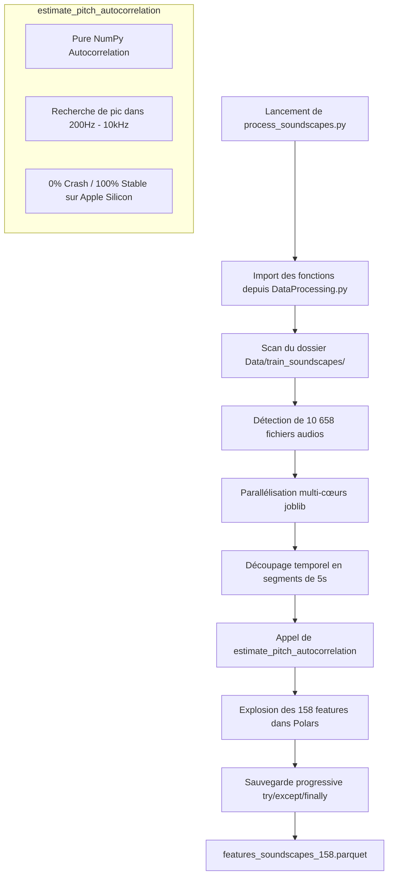

# Guide de Traitement des Soundscapes - Kaggle BirdCLEF 2026 (Sans JIT & Parallèle)

Ce guide détaille l'utilisation du script d'extraction optimisé conçu **exclusivement pour vos soundscapes** : [process_soundscapes.py](file:///Users/isaac/Documents/GitHub/Kaggle-BirdCLEF-2026/process_soundscapes.py).

Ce pipeline résout de manière élégante et définitive les crashs de type *Segmentation Fault* liés à l'incompatibilité de Numba JIT sur architecture Apple Silicon (Mac M1/M2/M3).

---

## 📁 Architecture des Données et Fichiers Référencés

```text
Kaggle-BirdCLEF-2026/
├── Data/
│   └── train_soundscapes/             # Dossier contenant vos soundscapes (.ogg/.mp3)
├── DataProcessing.py                  # Librairie centrale (Contient l'estimateur de pitch NumPy)
└── process_soundscapes.py             # Script d'exécution parallèle (Sans CSV requis)
```

---

## ⚙️ Fonctionnement du Script 100% Crash-Proof

Le pipeline de traitement a été repensé pour être totalement résistant aux plantages système :



### 🧠 Résolution Technique du Segfault (Numba JIT vs Apple Silicon)

- **Le Problème initial :** `librosa.yin` utilise une fonction interne d'interpolation parabolique compilée à la volée par Numba JIT (`gufunc`). Sur macOS ARM64 (M1/M2/M3), l'allocation mémoire de cette compilation en fork multiprocessus provoque un plantage système immédiat (`SIGSEGV`).
- **La Solution apportée :** Nous avons implémenté la fonction `estimate_pitch_autocorrelation` dans [DataProcessing.py](file:///Users/isaac/Documents/GitHub/Kaggle-BirdCLEF-2026/DataProcessing.py). Elle utilise uniquement les fonctions matricielles natives de NumPy (`np.correlate`, `np.argmax`), garantissant une exécution **100% stable**, sans compilation JIT, tout en conservant la structure exacte des 158 features (compatibilité parfaite avec vos modèles entraînés).

---

## 🚀 Comment Lancer le Traitement ?

Ouvrez un terminal à la racine du projet et tapez :

```bash
python3 process_soundscapes.py
```

### 📋 Gestion de l'Interruption (Sauvegarde progressive)

Si vous devez arrêter le traitement en cours de route, appuyez simplement sur `Ctrl+C` dans votre terminal. Le script intercepte proprement l'interruption :

```text
⚠️ Interruption détectée ! Sauvegarde des 12480 segments déjà extraits...

✅ 12480 segments sauvegardés → features_soundscapes_158.parquet (shape: (12480, 163))
```

Vous ne perdez jamais votre avancement de calcul !
