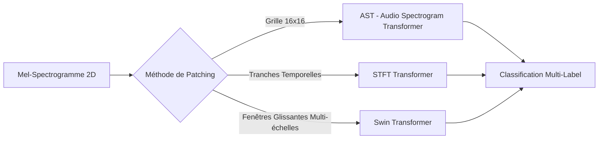

# Revue Technologique — Transformers & Mel-Spectrogrammes pour BirdCLEF

Ce document récapitule les principaux papiers de recherche et les approches basées sur les architectures **Transformers** appliquées aux **Mel-spectrogrammes** dans le cadre des compétitions **BirdCLEF (LifeCLEF)**. Il a pour but d'inspirer les architectures et stratégies de modélisation pour l'édition **BirdCLEF 2026** (Pantanal, Brésil).

---

## 1. Modèles Fondateurs & Papiers Clés

Plusieurs publications scientifiques et retours d'expérience de compétitions passées décrivent l'adaptation des Transformers à la bioacoustique.

### 📄 Papier 1 : "AST: Audio Spectrogram Transformer" (Gong et al., 2021)
*   **Concept** : C'est le modèle de référence absolue pour l'application des Transformers à l'audio sans convolution (purely attention-based).
*   **Méthodologie** :
    *   L'audio est converti en un **Mel-spectrogramme à 128 bandes** (généralement calculé avec un pas de 10 ms et une fenêtre de 25 ms).
    *   Ce spectrogramme 2D est découpé en une grille de **patchs de 16x16 avec chevauchement** (overlap), similaire à la façon dont Vision Transformer (ViT) traite les images.
    *   Chaque patch est projeté linéairement dans un vecteur d'embedding 1D auquel on ajoute des **positional encodings temporels et fréquentiels**.
    *   Un Transformer standard (souvent initialisé avec des poids pré-entraînés sur ImageNet) traite ensuite cette séquence de patchs.
*   **Intérêt pour BirdCLEF** : Captation exceptionnelle des relations globales temps-fréquence. Les mécanismes d'auto-attention permettent au modèle de se focaliser sur des chants de haute fréquence même en présence de bruit de fond basse fréquence.

### 📄 Papier 2 : "STFT Transformers for Bird Song Recognition" (Puget, 2021)
*   **Concept** : Présenté lors de BirdCLEF 2021 (médaille d'or), ce papier propose d'adapter le Vision Transformer (ViT) de manière plus "acoustique".
*   **Méthodologie** :
    *   Au lieu de découper le spectrogramme en grilles 16x16 (qui détruisent la continuité temporelle absolue de l'audio), le modèle utilise des **"time slices"** (tranches de temps complètes sur toutes les fréquences).
    *   Chaque tranche temporelle devient un token alimenté dans l'encodeur du Transformer.
*   **Intérêt pour BirdCLEF** : Conserve la structure temporelle et permet d'utiliser des mécanismes d'attention pour comprendre l'évolution séquentielle des syllabes d'un oiseau au cours du temps.

### 📄 Papier 3 : "A Comparative Analysis of Transformer Models for Bird Song Recognition Using Mel-Spectrograms" (Winarno & Irmawati, 2024)
*   **Concept** : Évaluation comparative des modèles ViT, DeiT (Data-efficient Image Transformer) et Swin Transformer sur les ensembles de données BirdCLEF.
*   **Méthodologie & Conclusions** :
    *   Le **Swin Transformer** (Shifted Window Transformer) surpasse les ViT classiques sur les Mel-spectrogrammes de chants d'oiseaux.
    *   Swin calcule l'attention locale dans des fenêtres glissantes non-chevauchantes, puis décale ces fenêtres à la couche suivante, ce qui limite la complexité calculatoire quadratique tout en maintenant une excellente modélisation multi-échelle (très utile pour capter des cris très courts comme des chants continus).
    *   Le papier souligne un risque majeur de **surapprentissage (overfitting)** sur les enregistrements focaux propres d'entraînement, nécessitant des stratégies d'augmentation de données massives (Mixup, SpecAugment, bruits de fond réels du Pantanal).

---

## 2. Synthèse Comparative des Architectures

| Architecture | Type d'Input | Avantages | Inconvénients / Limites pour BirdCLEF 2026 |
| :--- | :--- | :--- | :--- |
| **EfficientNet (CNN)** *(Baseline classique)* | Mel-spectrogramme 2D | • Ultra-rapide en inférence (CPU) • Très robuste avec peu de données | • Difficulté à modéliser des dépendances temporelles très longues (limitations des champs récepteurs locaux). |
| **AST (Audio Spectrogram Transformer)** | Mel-spectrogramme 2D (16x16 patches) | • SOTA en bioacoustique globale • Capture les harmoniques distantes | • Inférence lourde sur CPU (Kaggle limit à 90 min) • Sensible au bruit si non pré-entraîné sur l'audio (ex. AudioSet). |
| **Swin Transformer (ViT)** | Mel-spectrogramme 2D (Swin-patching) | • Excellente modélisation multi-échelle (chants longs vs cris brefs) • Plus efficace en RAM que ViT | • Complexité d'implémentation et de tuning • Temps d'inférence CPU non négligeable. |
| **MobileViT / ConvNeXt-ViT (Hybrides)** | Mel-spectrogramme 2D | • Combine la vitesse des convolutions locales et la puissance globale de l'attention • Adapté aux contraintes CPU | • Demande un ajustement minutieux des hyperparamètres pour éviter les instabilités d'entraînement. |

---

## 3. Stratégies Clés pour BirdCLEF 2026 (Pantanal)

Pour exploiter efficacement les Transformers dans l'édition 2026 en tenant compte des contraintes matérielles (inférence CPU sur Kaggle) :

### A. La Distillation de Connaissances (Knowledge Distillation)
Puisque les modèles géants comme AST ou Swin-Large ne peuvent pas tourner en temps réel sur les 600 fichiers de test de 1 minute dans le temps imparti (90 minutes CPU), la stratégie moderne consiste à :
1.  Entraîner un **"Teacher"** puissant (ex. Swin-Base ou AST) sur GPU sans contrainte de taille.
2.  Transférer ses probabilités et activations à un **"Student"** léger (ex. MobileViT, EfficientNet-B0 ou un Transformer compressé).

### B. L'utilisation d'Embeddings pré-entraînés (ex. Google Perch / BirdNET)
Dans l'édition 2026, l'utilisation de modèles fondations pré-entraînés sur des millions d'audios d'oiseaux est une arme redoutable :
*   **Google Perch (v2)** ou **BirdSet** génèrent des embeddings compacts à partir de l'audio brut ou des spectrogrammes.
*   On peut greffer un **petit Transformer léger (1 ou 2 couches d'attention)** par-dessus ces embeddings pré-calculés pour modéliser la séquence des 12 segments de 5s constituant la minute de soundscape, assurant une inférence CPU extrêmement rapide.

### C. Augmentation de Données Acoustiques (Indispensable pour Transformers)
Les Transformers n'ayant pas de biais inductif spatial comme les CNN, ils ont besoin de beaucoup plus de régularisation :
*   **SpecAugment** : Masquage aléatoire de bandes de fréquences et de blocs de temps sur le Mel-spectrogramme pour forcer l'attention à se répartir.
*   **Background Noise Mixing** : Injection de bruits réels du Pantanal (pluie, vent) sous les cris d'entraînement pour endurcir l'attention du modèle.
